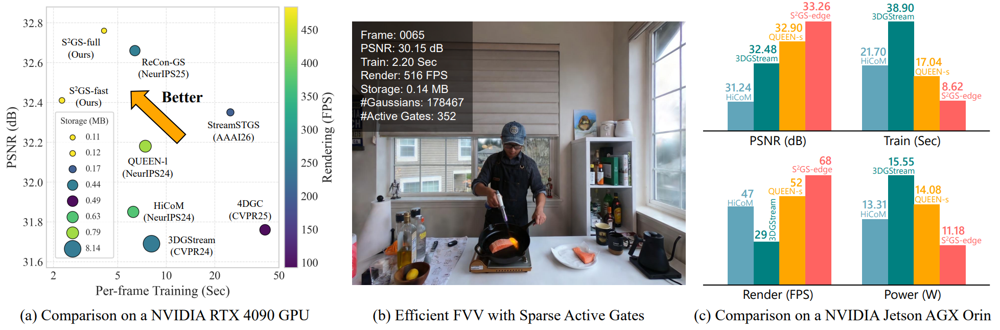
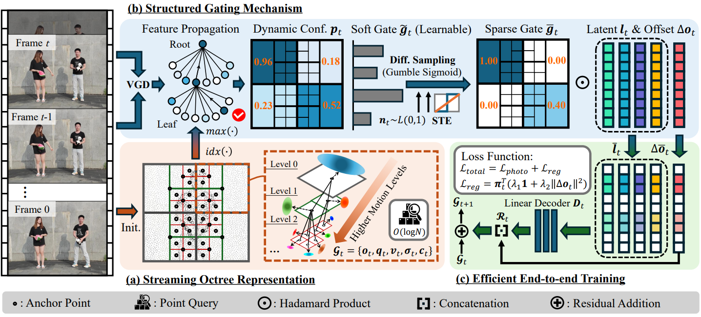
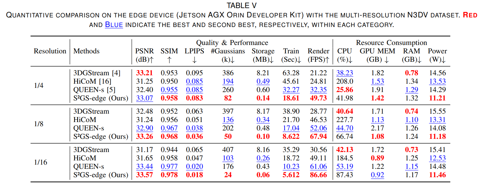
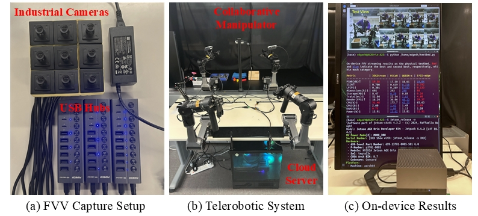
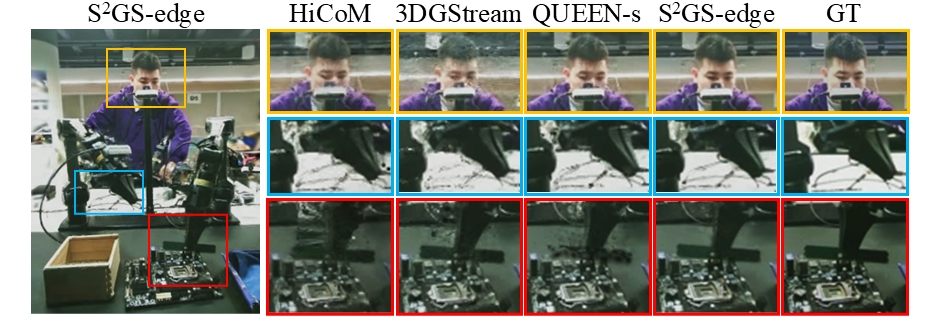

# S²GS: Structured Sparse Gaussian Streaming for Efficient Free-Viewpoint Video Reconstruction

### [Project Page](https://liyw420.github.io/s2gs-project-page/) | [Paper](https://arxiv.org/abs/2608.19639) | [Supplementary Material](https://github.com/liyw420/S2GS_SupplementaryMaterial)

[*Yiwei Li*](https://scholar.google.com/citations?user=RYUlClcAAAAJ&hl=en),
[*Jiannong Cao*](https://www4.comp.polyu.edu.hk/~csjcao/),
Weixun Gao,
Rui Cao,
[*Songye Zhu*](https://www.zhusongye.com/),
[*Yinfeng Cao*](https://cyfaaa.github.io/), and
[*Mingjin Zhang*](https://scholar.google.com/citations?user=d08lrQ0AAAAJ&hl=en)

<div align="center">
  
</div><br/>

**This repository is the official implementation of "S²GS: Structured Sparse Gaussian Streaming for Efficient Free-Viewpoint Video Reconstruction".** In this paper, we propose S²GS, an FVV reconstruction framework that exploits structure-aware temporal sparsity to selectively update Gaussian residuals, enabling efficient streaming without compromising visual fidelity. Notably, compared with [QUEEN](https://github.com/NVlabs/queen), S²GS reduces Gaussian primitives by 67.6%, storage costs by 84.9%, and training time by 59.5%, while achieving 480+ FPS rendering on the N3DV dataset. On the [Jetson AGX Orin](https://www.nvidia.com/en-us/autonomous-machines/embedded-systems/jetson-orin/), S²GS delivers the highest rendering throughput (60+ FPS) and the lowest energy consumption, demonstrating its potential for deployment in resource-constrained systems.

---
## 🔥 News
- 2026/02: Initial code release!

---
## 🛠️ Pipeline
<div align="center">
  
</div><br/>

**Overview of the S²GS framework.** (a) The streaming octree representation is initialized using root Gaussian primitives from the first frame and subsequently represents FVVs with multi-resolution grids, enabling hierarchical allocation of Gaussian residuals and efficient point queries for FVV streaming. (b) A structured gating mechanism is introduced to induce sparse Gaussian residual updates through hierarchical feature propagation, differentiable sampling with Gumbel-Sigmoid, and multi-level (ML) discretization using a straight-through estimator (STE). (c) A sparse regularization loss is incorporated to enable efficient end-to-end optimization of structured gates and sparse residual updates.

## 🌟 Get started

### Environment

The hardware and software requirements are the same as those of the [QUEEN](https://github.com/NVlabs/queen), which this code is built upon. To setup the environment, please follow:

```shell
git clone https://github.com/liyw420/S2GS
cd S2GS
# Install dependencies from requirements.txt
pip install -r requirements.txt

# Install CUDA-dependent submodules
pip install --no-build-isolation ./submodules/simple-knn
pip install --no-build-isolation ./submodules/diff-gaussian-rasterization
pip install --no-build-isolation ./submodules/gaussian-rasterization-grad
```

### Data preparation

**N3DV dataset:**

Download the [Neural 3D Video dataset](https://github.com/facebookresearch/Neural_3D_Video) and extract vidoes of each scene to `./data/dynerf/scene_name`. After running, the dataset would be organized as follows:
```
| --- data
|   | [dataset_directory]
│     | [scene_name] 
│   	  | cam01
|            | images
|     		  | ---0000.png
│     		  | --- 0001.png
│     		  | --- ...
│   	  | cam02
|            | images
│     		  | --- 0000.png
│     		  | --- 0001.png
│     		  | --- ...
│   	  | ...
│   	  | sparse_
│     		  | --- cameras.bin
│     		  | --- images.bin
│     		  | --- ...
│   	  | points3D_downsample2.ply
│   	  | poses_bounds.npy
```
**Meet Room dataset:**

Download the [Meet Room dataset](https://github.com/AlgoHunt/StreamRF?tab=readme-ov-file) and extract videos of each scene to `./data/meetroom/scene_name`.

**ENeRF Outdoor dataset:**

Please reach out to the authors of the paper [Efficient neural radiance fields for interactive free-viewpoint video](https://github.com/zju3dv/ENeRF) for access to the dataset. Please extract videos of each scene to `./data/enerf/scene_name`.

### End-to-end Running

For data preprocessing, model training, rendering, and evaluation on the N3DV Dataset:

```
bash ./scripts/pre_dynerf/run_train_eval.sh
```
For data preprocessing, model training, rendering, and evaluation on the Meet Room Dataset:

```
bash ./scripts/pre_meetroom/run_train_eval.sh
```
For data preprocessing, model training, rendering, and evaluation on the ENeRF Outdoor Dataset:

```
bash ./scripts/pre_enerf/run_train_eval.sh
```
---
### Real-world Deployment
<div align="center">
  
</div><br/>

We conduct deployment experiments on the **NVIDIA Jetson AGX Orin Developer Kit**, a leading industrial edge computing platform. Results demonstrate the strong visual quality, high timeliness, and low resource consumption of S²GS-edge, making it well-suited for FVV streaming on resource-constrained industrial environments. 

<div style="display: flex; justify-content: center; gap: 20px; align-items: flex-start;">
  
  
</div>

We also develop an FVV streaming system based on a telerobotic platform. Immersive digital twins of human operators are reconstructed online to record and demonstrate the teleoperation procedures of robotic arms. The case study provides proof-of-concept validation of the efficiency and effectiveness of S$^2$GS in a real-world industrial prototype.

## 🙏 Acknowledgements

S²GS builds upon the original [QUEEN](https://github.com/NVlabs/queen) codebase. Besides, we thank all authors from [Octree-GS](https://github.com/city-super/Octree-GS) and [3D Gaussian Splatting](https://github.com/graphdeco-inria/gaussian-splatting) for their contributions.
